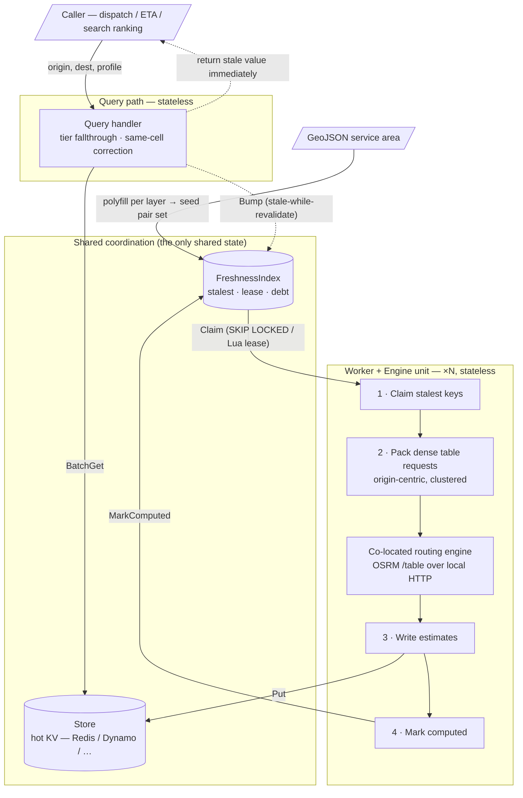

# Beeline — Design Doc (v0.1)

> Working title. A self-hostable server that precomputes travel-time/distance
> matrices between H3 cells and continuously refreshes them to meet a freshness
> SLO, so that latency-sensitive callers can read cached estimates instead of
> hitting a live routing engine.
>
> Status: **DRAFT / iterating.** This is a thinking document, not a spec. Sections
> marked `OPEN` are unresolved. Prior art: DoorDash's "How DoorDash achieves fast
> travel estimates" (2025) and Snowflake's H3 travel-time-matrix writeup.

---

## 1. Motivation

Live routing (OSRM/Valhalla/GraphHopper) gives accurate travel time + distance but
pays >100ms per call and burns CPU on shortest-path search. A large class of
callers — dispatch/matching, ETA display, search ranking, fee estimation — only
need the **scalar** answer (duration, distance), never the route geometry, and
need it in single-digit milliseconds at high QPS.

The fix is well known: tessellate the service area into H3 cells, precompute the
cell-to-cell adjacency matrix, cache it, and serve reads as a keyed lookup.
Beeline packages that pattern as a reusable, engine-agnostic, store-agnostic
server whose defining feature is an explicit **freshness contract**.

## 2. Goals / Non-goals

**Goals**
- Ingest service-area geometry (GeoJSON), tessellate to configurable H3
  resolutions, and maintain a precomputed matrix per (profile, resolution).
- Pluggable routing engine behind a **matrix-shaped** interface.
- Pluggable datastore for the hot read path; pluggable freshness index for
  scheduling.
- Continuously refresh entries to meet a target freshness, and **expose whether
  it is meeting it** as a first-class, alertable signal.
- Scale horizontally: add a node, watch freshness debt burn down faster.

**Non-goals**
- Route geometry / polylines / turn-by-turn. If a caller needs shape, it calls
  the live engine directly. Beeline answers scalars only.
- Live-traffic reactivity at minute granularity. Freshness is a batch-cadence
  contract (minutes-to-hours), not a real-time feed. This is deliberate and is
  the whole reason precompute is viable.
- Being a routing engine. Beeline orchestrates one; it does not implement one.

## 3. The freshness model (the core idea)

We do **not** promise "every entry is younger than T." On an arbitrary matrix
under finite engine capacity that is unenforceable, and pretending otherwise is
the trap that makes people cron a full rebuild every T and let build time become
the floor on freshness.

Instead the contract is a **refresh throughput** and an observable **freshness
debt**.

```
required_throughput = working_set_size / target_ttl      # entries/sec we must sustain
```

Steady state is **continuous incremental refresh**, never periodic full rebuild.
A full build happens only on cold start or a config/graph-version change.

The signal that actually matters:

- `freshness_debt` = count of entries whose age > `target_ttl`
- `oldest_entry_age` = p100 staleness
- `refresh_throughput` (achieved) vs `required_throughput` (target)

If debt is flat-or-shrinking and p100 ≤ target, the cluster is keeping up. If debt
trends up, you are under-provisioned on **engine capacity** (see §7) — an
alertable condition, not a silent lie. This is the number Beeline surfaces that a
Spark cron job does not.

**Demand-aware refresh (stale-while-revalidate):** a read that hits a stale entry
bumps that pair's refresh priority. Freshness budget then flows to pairs people
actually query, which for delivery is a small hot fraction of the N² space. Reads
always return the stale value immediately; refresh is async.

## 4. Architecture

Two data paths, deliberately decoupled. They share only the Store (writes) and the
FreshnessIndex (claims).



**Key architectural bet — co-locate the engine with the worker.** DoorDash's 10x
came from installing OSRM on each Spark executor and replacing network calls with
local HTTP. We adopt the same: each worker ships with (or sidecars) its own engine
instance loaded with the same graph. Consequences:

- Each `worker + engine` is a self-contained unit. Adding a worker adds engine
  capacity in lockstep — no shared engine tier to become the bottleneck.
- The only shared state is the Store (batched writes) and the FreshnessIndex
  (batched claims), both of which are far higher-throughput than routing compute.
- Linear scaling holds cleanly until the shared index/store saturates, which is
  much later than engine saturation.

## 5. Component interfaces

Interface-first; these are the seams. Go sketch, illustrative not final.

### 5.1 RoutingEngine (matrix-native)

The whole batching win depends on this being a **matrix**, not point-to-point.
1×1 is a degenerate case, not the primitive.

```go
type RoutingEngine interface {
    // Table computes the full cartesian product of Sources × Destinations.
    // (This is the ONLY shape OSRM/Valhalla/GraphHopper natively offer; see §6.)
    Table(ctx context.Context, req TableRequest) (TableResponse, error)
    Capabilities() Capabilities
}

type TableRequest struct {
    Sources      []LatLng
    Destinations []LatLng
    Profile      Profile
    Want         Annotations // Duration | Distance | both
}

type TableResponse struct {
    Duration [][]float64 // seconds; len(Sources) x len(Destinations)
    Distance [][]float64 // meters;  optional per Want
}

type Capabilities struct {
    MaxTableSize     int   // bound on matrix size; see §6 note on semantics
    SupportedProfiles []Profile
    SupportsDistance bool
}
```

### 5.2 Store (hot read path — keep it tiny)

Deliberately minimal so "bring your own datastore" is actually true. No range
queries, no ordering requirements — any KV that can batch-get qualifies (Redis,
DynamoDB, Aerospike, an embedded LSM…).

```go
type Store interface {
    BatchGet(ctx context.Context, keys []PairKey) ([]Stored, error) // nil for misses
    Put(ctx context.Context, entries []Stored) error
}
```

### 5.3 FreshnessIndex (scheduling brain — where the smarts live)

The scheduler needs "give me the N stalest keys" plus atomic claim. That is a
range/priority query most KV stores don't do natively, so we do **not** force it
onto Store. The index can be Postgres or an embedded sorted structure even when
the hot cache is Redis.

```go
type FreshnessIndex interface {
    // Claim atomically leases up to `limit` stalest keys with a visibility
    // timeout. At-least-once; writes are idempotent so double-compute is waste,
    // not corruption. (Postgres: SELECT ... FOR UPDATE SKIP LOCKED.)
    Claim(ctx context.Context, limit int, lease time.Duration) ([]PairKey, error)
    MarkComputed(ctx context.Context, keys []PairKey, at time.Time) error
    Bump(ctx context.Context, keys []PairKey) error            // demand-driven priority
    Invalidate(ctx context.Context, sel Selector) error        // TTL sweep, graph bump, manual
    Debt(ctx context.Context) (DebtStats, error)               // powers §3 metrics
}

type PairKey struct {
    Origin, Dest H3Cell
    Profile      Profile   // mode, and OPTIONALLY a time-of-day bucket (§9)
    Res          int
}
type Stored struct {
    Estimate
    ComputedAt time.Time
}
```

## 6. Engines are dense; plan the pair-set around it

**OSRM `/table` (and Valhalla `sources_to_targets`, GraphHopper matrix) return the
full cartesian product of the selected sources × destinations. There is no sparse
mode.** `sources=` and `destinations=` are index subsets of one coordinate list,
but you always get the dense rectangle they span. To obtain pairs (a,b) and (c,d)
without also computing (a,d) and (c,b), you either issue two 1×1 calls or request
the 2×2 and discard the off-diagonal. `MaxTableSize` bounds the matrix (verify
per-version whether it counts coordinates or the sources×destinations product;
the public demo caps at 10k cells).

This is decisive for how we batch:

- **Origin-centric dense packing (primary path).** For a given origin cell, the
  destinations we want are its ring of reachable neighbors within travel radius.
  That is a `1 × K` table request that is **fully utilized** — no waste. This is
  the natural, efficient shape and the scheduler should prefer it.
- **Cluster co-located origins.** Group spatially-adjacent stale origins and issue
  one `M × N` block over the union of their neighborhoods. Because neighbor rings
  overlap heavily, most cells of the block are pairs we want; waste is only the
  far corners. For a compact cluster this is highly efficient, and OSRM's
  many-to-many shares search work across the block, so a dense `M×N` is far
  cheaper than `M×N` individual `/route` calls.
- **Sparse demand-driven pairs (secondary path).** Stale-while-revalidate bumps
  arbitrary scattered pairs. These do **not** pack into dense blocks. Handle them
  on a separate, lower-efficiency lane: cluster geographically and accept some
  over-computation, or fall back to small/1×1 calls and eat per-request overhead.
  Keep this lane rate-limited separately so the sparse tail can't starve the dense
  bulk-refresh.

Design rule: **structure refresh work to be dense and origin-centric; treat
sparse refresh as a distinct, bounded lane.**

## 7. Bounding the pair set (or it's dead on arrival)

Full N² is a non-starter (SF→NYC is a real cell pair nobody wants). Both prunings
compound because the matrix is quadratic.

- **Travel-radius bounding.** For each origin, only materialize destinations within
  a max travel time/distance. Turns O(N²) into ~O(N·k), k = reachable cells in
  radius. The multi-resolution tiering is secretly doing this already: coarse tiers
  for the long tail, fine tiers for the dense near field.
- **Road-aware tessellation.** Drop cells with no road network before building
  (spatial semi-join against OSM/Overture). Drop ~40% of cells → drop ~64% of
  pairs. Biggest single build-cost lever. (The prototype ships no road mask —
  every layer is a pure polyfill of the area's GeoJSON; a real deploy could
  introduce an automated semi-join here.)
- **Multi-resolution tiering.** Store each point at 3 resolutions; at query time
  select the highest (finest) available tier. Balances hit rate vs accuracy and
  handles both short and long trips. (DoorDash: res ~10 fine, mid, res ~6 coarse.)

Ingestion is therefore: `polyfill(geojson, res)` per layer resolution → seed
FreshnessIndex with the resulting per-layer pair sets.

## 8. Scaling & coordination

**You almost certainly do not need a consensus algorithm for the data plane.** The
workload is embarrassingly parallel idempotent refresh. What you need is atomic
work-claiming, which is a *leased queue*, not Raft/Paxos.

- **Shared leased queue over the FreshnessIndex.** Workers are stateless and
  coordination-free: they all `Claim()` from the same index with a visibility
  timeout, compute, `Put()`, `MarkComputed()`. A dead worker's lease expires and
  another picks the batch up. Postgres gives you this directly with
  `SELECT ... FOR UPDATE SKIP LOCKED`; Redis with a sorted set + atomic Lua
  pop-with-lease and an in-flight set reclaimed on expiry.
- **Why this yields the "add a node, watch % climb" property.** Aggregate claim
  rate rises linearly with worker count; freshness debt burns down proportionally.
  No membership, no keyspace sharding, no leader needed — the index *is* the
  coordination point.
- **The real bottleneck is routing compute, not workers.** Which is exactly why
  §4 co-locates an engine per worker: each node brings its own capacity, so
  scaling stays linear instead of hammering a shared engine tier.

**Where consensus legitimately shows up (and how to avoid writing it):**

- *Singleton global planner* (if we ever want one central brain allocating a
  cluster-wide rate/cost budget, rather than each worker self-limiting): that's
  **leader election**, satisfied by an off-the-shelf lease — Postgres advisory
  lock, etcd/Consul session. Use consensus, don't implement it.
- *Self-organizing pool awareness* (showing pool status, or sharding the keyspace
  instead of sharing one queue): that's **membership**, and SWIM gossip
  (hashicorp/memberlist) is the right, lightweight tool — still not Raft.

Recommendation for v1: **shared leased queue, stateless workers, no consensus,
per-worker self-throttling.** Revisit a central planner only if per-worker budget
allocation proves insufficient.

### 8.1 The implemented protocol: `/_work_/claim` + `/_work_/submit`

This is what shipped — the shared-leased-queue shape above, split over HTTP. The
`serve` process is the **leader**: it owns the in-memory freshness index (the
queue) and the hot store. Any number of `beeline work` processes are
**followers**. "Leader" here means "the process that owns the index," not an
elected role — there is still no consensus and no membership. Followers are fully
stateless: no database, no store, no index, just the claim→compute→submit loop
plus health probes. One pool implementation (`internal/refresh.Pool`) drives both
roles through the `refresh.WorkSource` seam: a leader wires it to its own
index+store (`LocalSource`), a follower to the HTTP client in `internal/follower`.

Both endpoints are JSON POSTs on the leader's main port. Like every endpoint in
the prototype they are unauthenticated; a real deploy would gate them.

**`POST /_work_/claim`** — lease up to `batchSize` due pairs.

```json
// request
{"batchSize": 512, "leaseSeconds": 30}

// response
{
  "pairs": [
    {"profile": "car", "origin": "882a100d2bfffff",
     "dest": "882a100d2dfffff", "area": 3, "res": 8}
  ],
  "areas": {"3": {"routingProvider": "latency-sim"}},
  "providersHash": "9f2c…",
  "leaseSeconds": 30
}
```

- Zero `batchSize`/`leaseSeconds` fall back to the leader's own `refreshBatch`
  and `leaseDuration`; explicit values are capped (10 000 pairs, 10 minutes) so
  a buggy client cannot park huge swaths of the queue out of sight. The granted
  (defaulted/capped) lease is echoed back so the follower knows its visibility
  budget — though an area's per-area lease override, when set, wins over the
  requested value.
- Cells travel as hex H3 strings; `area` + `res` name the partition and
  precision layer the estimate must be written back under. Submit echoes all
  five fields verbatim.
- `areas` carries metadata for each distinct area in the batch — today just the
  routing-provider name, which the follower resolves against a provider registry
  **synced from the leader itself**. `providersHash` is the content hash of the
  leader's provider catalog (`GET /_work_/providers`: every provider spec —
  built-ins included — plus the profile speed map). A follower holding a
  different hash fetches the catalog and rebuilds its engines *before* computing
  the claim; a failed sync fails the claim so pairs are never computed with
  engines the leader no longer intends (the leases just expire back into the
  queue). Provider configuration therefore lives in exactly one place — the
  head's `/_config_/providers` registry (Postgres-backed; a legacy
  `matrix.providers` config block seeds an empty table once) — and repointing
  the whole cluster at a different OSRM instance is one control-plane call that
  propagates to every follower within one claim cycle. A follower needs nothing
  but a leader URL. The unknown-name fallback (default engine, once-per-name
  warning) survives only as a guard against pre-catalog leaders.
- Claims go through the same `Index.Claim` the leader's local workers use, so
  local workers and followers drain one queue in identical priority order.

**`POST /_work_/submit`** — write a computed batch back.

```json
// request
{"results": [
  {"profile": "car", "origin": "882a100d2bfffff",
   "dest": "882a100d2dfffff", "area": 3, "res": 8,
   "durationSec": 118.4, "distanceMeters": 986.2}
]}

// response
{"accepted": 1}
```

Submit is `Store.Put` + `MarkComputed` — the remote half of what
`LocalSource.Submit` does in-process. Three deliberate choices:

- **No timestamp travels.** The leader stamps `ComputedAt` with its own clock at
  receipt, so follower clock skew can never distort freshness ordering. The
  cost — one network RTT of apparent extra freshness — is noise against TTLs
  measured in tens of seconds.
- **Results for areas disabled since the claim are silently dropped** (`accepted`
  counts only what was written). `MarkComputed` would ignore the vanished keys
  anyway, but `Store.Put` would happily resurrect estimates the disable just
  purged.
- **An invalid H3 cell fails the whole request** (400). Results echo
  leader-issued keys, so garbage here means a broken follower — protocol drift —
  not bad user input worth partial tolerance.

Error surface: both endpoints answer 400 for a malformed body or negative/
oversized values and 500 for an index/store failure. The follower treats any
non-200 as an error carrying the (truncated) response body.

**Failure semantics: idempotent by construction.** The protocol has no acks, no
retries, no session state, because none are needed:

- A follower that dies, hangs, or loses connectivity simply lets its leases
  expire; the pairs become claimable again and another worker recomputes them.
- A duplicate submit — say, after a lease expired and someone else recomputed
  the pair — is a harmless overwrite with an equally valid estimate.
- On a submit error the pool drops the batch and moves on; the leases expire and
  the pairs are reclaimed. Every failure mode costs wasted compute, never
  corruption.

**Follower loop behavior.** Each follower worker loops claim→compute→submit; an
empty claim (caught up) or a claim error sleeps `idleBackoff` (default 250 ms)
and retries. Knobs live in `matrix.follower` (leader URL, workers, batch, lease,
idle backoff, outbound HTTP client, health port); zero batch/lease fall back to
the shared `refreshBatch`/`leaseDuration`, so an untuned follower paces itself
like a local worker. The follower's only HTTP surface is `/_ops_/live` and
`/_ops_/ready` (= leader reachable) on `matrix.follower.port` (default 8081). A
leader started with `refreshWorkers: 0` computes nothing itself — a pure
coordinator; `make demo-cluster` stages exactly that.

### 8.2 Stateless heads over shared Postgres

This is the scale-out of the *leader* itself, and it is deliberately **not a
consensus pool**. Every piece of mutable coordination state lives outside the
process in shared storage, which is why "leader" is not a role: every `serve`
instance is an identical, disposable request head, and there is nothing left to
elect a leader *of* except two singleton chores.

This is no longer opt-in — it is the only mode. The zero-dependency single-node
build (in-memory index and store, SQLite operator config) has been **deleted**,
along with `matrix.backend.mode`, so `matrix.backend.postgres.url` is required and
`make demo` needs Docker. That trade is deliberate: keeping a per-head in-memory
backend alive meant every design conversation carried a second set of operational
semantics, and "how does this degrade without Postgres?" was a question about a
deployment nobody ran. One backend, one set of semantics, one deployment story.
The in-memory implementations survive as **test doubles only**, unwired from the
CLI and pinned to the real backends by conformance suites.

Where the state went:

- **FreshnessIndex → Postgres** (`internal/freshness/postgres`). Claim is the
  §5.3 shape verbatim: `SELECT … ORDER BY bumped DESC, computed_at ASC NULLS
  FIRST LIMIT n FOR UPDATE SKIP LOCKED`, then stamp `lease_until` — the leased
  queue with the same due-ness, priority, and per-area TTL/lease semantics as
  the in-memory test double (one conformance suite,
  `internal/freshness/freshnesstest`, runs against both, so the double cannot lie
  about the backend that ships). The read path's per-query `Access`
  stamps coalesce in a bounded in-process buffer and flush in batches;
  `MarkComputed` flushes its own keys first, inside its transaction, so the
  demand-fill commit's Access→Mark ordering holds.
- **Hot store → Postgres or Redis** (`internal/store/postgres`,
  `internal/store/redis`), selected by `matrix.backend.hotStore`. The
  benchmark gate (`make bench-store`, 300k-key `BatchGet`) measured Postgres
  p95 ≈ 275 ms and Redis ≈ 146 ms on the reference setup — both far inside the
  sub-second contract — so **Postgres is the blessed default** (one shared
  dependency); Redis remains a config flip for deployments that want the batch
  headroom.
- **Operator config → Postgres** (`internal/store/postgres` repositories).
  Derived projections —
  polyfilled cell sets, built engines, the provider catalog — stay per-head
  in-process, converged by a `config_version` generation counter bumped in the
  same transaction as every mutation and polled every
  `matrix.backend.configPollInterval` (default 2 s): an Enable through head A
  routes on head B within one poll. LISTEN/NOTIFY is a drop-in accelerant if
  sub-second convergence is ever wanted.
- **The clock → Postgres `now()`.** Leases, staleness, `computed_at`, access
  recency: all stamped and compared by the database, so head/follower clock
  skew is irrelevant. The single-clock argument from 8.1 survives scale-out by
  making the shared store the clock. (The read path's `time.Since(ComputedAt)`
  staleness display and the sweep cadence remain process-clock: NTP-scale skew
  against tens-of-seconds TTLs. The Redis store's value-embedded `ComputedAt`
  is head-stamped — worst case a skewed staleness *display*, never a skewed
  refresh order.)
- **Still no fencing tokens.** `SKIP LOCKED` + `lease_until` reproduce the
  visibility timeout; writes stay idempotent; and because the pg index stamps
  its own authoritative `computed_at`, a straggler's late submit cannot regress
  freshness ordering. The consensus that legitimately remains is tiny and
  off-the-shelf, exactly as predicted above: a per-tick
  `pg_try_advisory_xact_lock` elects which head runs a janitor sweep, a boot
  advisory lock serializes simultaneous first boots (the winner seeds the
  index; later heads find the working set populated and only re-project), and
  per-area advisory locks keep two heads' lifecycle mutations of one area from
  interleaving.

Followers are untouched: they still speak `/_work_/claim|submit` to "the
leader," which is now any head behind a load balancer. `make demo-multihead`
stages the whole thing — two heads over one containerized Postgres, followers
split between them, one area enabled through head A and served by both; kill
either head and the other keeps the freshness contract.

Accepted looseness: a head's `AreaEnabled` snapshot lags a disable elsewhere by
up to one poll interval, so a follower submit routed through the lagging head
can re-insert store rows the disable just purged. The index rows stay gone, the
orphans are invisible to reads (routing only consults enabled areas), and a
re-enable reseeds and refreshes them; bounded, self-healing, documented rather
than defended with more machinery.

## 9. Accuracy semantics (document these; don't let them surprise callers)

- **Center-to-center error.** Every estimate is cell-center to cell-center; true
  endpoints sit somewhere in the cell, so error scales with cell size. Surface a
  per-tier expected-error figure.
- **Same-cell collapse.** Origin and dest in one fine cell → ~0 distance, wrong for
  a real trip. Handle explicitly: fall through to a finer tier, or compute a
  within-cell correction (haversine on true lat/lngs, or a small fixed intra-cell
  estimate). This is *why* fine-res-only fails on short trips.
- **Asymmetry.** A→B ≠ B→A (one-ways, turn restrictions). Store both directions;
  do not halve storage by assuming symmetry.
- **Profile as a dimension — including time-of-day? `OPEN`.** DoorDash uses a
  single "average traffic" number: cheap, blind to rush hour. Making `Profile`
  optionally carry a time-of-day bucket buys much better estimates but multiplies
  the matrix by the bucket count. Make it an opt-in key dimension, not a hardcoded
  assumption.

## 10. Config surface (first cut)

- Service-area geometry: GeoJSON (Feature/FeatureCollection of Polygons).
- H3 resolutions: ordered list, e.g. `[6, 8, 10]`.
- Profiles: modes (`car`, `bike`, `walk`), optional time buckets.
- Travel-radius bound per resolution (time or distance).
- `target_ttl` (the freshness target driving §3).
- Engine adapter + endpoint(s); Store adapter; FreshnessIndex adapter.
- Rate/cost budget per worker (and per lane: dense vs sparse).

## 11. Observability (must-haves, not nice-to-haves)

- `freshness_debt`, `oldest_entry_age` (p100), `refresh_throughput` vs
  `required_throughput` — the §3 contract.
- Read path: hit rate per tier, tier-fallthrough distribution, same-cell rate,
  read latency p50/p99.
- Refresh path: table-request utilization (wanted cells / computed cells — catches
  sparse-lane waste), engine call latency, claim contention.

## 12. Open questions

- `OPEN` Time-of-day buckets in the key, or single average? (§9)
- `OPEN` Store both matrices (fine + coarse) fully, or coarse-on-demand?
- `OPEN` How to represent "unreachable within radius" vs "not yet computed" vs
  "genuinely no route" distinctly in the Store.
- `OPEN` Graph-version changes: full invalidate + rebuild, or diff-based
  invalidation of only affected cells?
- `OPEN` Do we need per-worker keyspace affinity (cache locality on the engine
  graph) or is a shared queue fine? (Probably fine given co-located engines.)
- `OPEN` Sparse-lane batching heuristic: geographic clustering threshold, max
  acceptable over-computation ratio.

## 13. Rough milestones

1. **Single-node MVP.** GeoJSON → polyfill (one resolution) → OSRM adapter
   (dense, origin-centric) → Redis Store → in-memory FreshnessIndex → query path.
   Prove the read-latency win end to end.
2. **Freshness loop.** Continuous incremental refresh, debt metrics, target_ttl.
3. **Multi-resolution tiering** + tier fallthrough + same-cell handling.
4. **Pluggable adapters** solidified (Store, Index, Engine); Postgres index with
   `SKIP LOCKED`.
5. **Horizontal scale-out.** Co-located engine per worker; shared leased queue;
   demonstrate linear debt burn-down as nodes are added.
6. **Bounding.** Per-layer travel-radius bounds over pure polyfills (automated
   road-aware masking is a possible later optimization, not shipped).
7. **Sparse/demand lane.** Stale-while-revalidate, separate rate limit.
